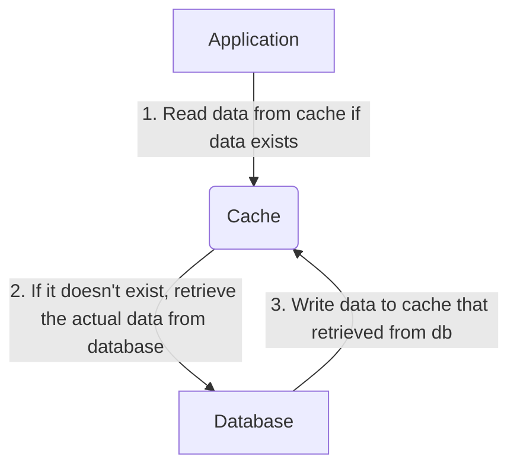

# Let's Build Your Own Cache System

## 1. Introduction

### 1.1. What is Caching?
Caching is a commonly used technique that used in to store frequently accessed data in a memory. In this article, we will discuss the in-memory cache, one of the types of caching.
In-memory caching is a widely used method of storing data in a RAM to provide faster access than retrieving it from slower storage systems like hard drives.
We know that the data stored in memory is volatile; this means all data can be lost if the power goes off or if the system crashes. 
The capacity of data that can be stored is limited by the RAM capacity of the host of the application.

### 1.2. Which Data Should Be Cached?
Memory(RAM) is more expensive than hard disks, so scaling our cache system and deciding which data to cache play crucial roles in caching.
Datas that frequently accessed and changes infrequently is a good choice for determining which data will be cached. 
More static datas like lookup tables, fixed dropdowns, user preferences, profile settings can be cached.

### 1.3. Which Data Should Not Be Cached?
Data that changes very frequently, sensitive data like personal identification or passwords, and very large objects should not be cached.

## 2. Caching Techniques
Caching is a vital component in enhancing the performance and efficiency of applications. Various caching techniques are used to optimize data storage and access. 
These techniques can be used in different scenarios and requirements.

### 2.1. On-Demand Caching
On-demand caching stores only a necessary part of data that is actively used or is expected to be used in the near future, rather than storing all available data in a cache.

### 2.2. Pre-Population Caching
Pre-population cache is a approcah where specific data is loaded into a cache before it’s actually requested. It’s useful when you have a fixed lookups or fields.

## 3. Time Management in Caching
Two commonly used methods in cache management are fundamental for determining the time limitations of cached items. 
Understanding these concepts plays a crucial role in efficient cache management.

### 3.1. Absolute Time (Absolute Expiration)
With absolute time expiration, cache entry has a known and fixed(absolute) lifetime.
-**Example:** If a cache entry is set with an absolute time limit of 24 hours, it will be removed from the cache 24 hours after it was added.

### 3.2. Sliding Time (Sliding Expiration)
Sliding time expiration is suitable for cache entry that doesn’t have a fixed expiration but should be kept in cache as long as it is frequently accessed.
-**Example:** If a cache entry has a sliding expiration of 40 minutes, and it is accessed 5 minutes after being added to the cache, 
its expiration time will be reset to 10 minutes from that point. If it is not accessed again within those 40 minutes, it will then expire.

## 4. Let’s Code Our In-Memory Cache
There are already built-in memory cache in dotnet environment, but i want to show background as well.
To see the full example, you can check MemCache class or browse the minimal API endpoints and the rest of the repository.

## 5. Conclusion
In conclusion, caching is a vital component in the landscape of modern software development, especially for enhancing the performance and scalability of applications. 
In this repo, I have attempted to provide a more detailed analysis of in-memory caching.

Happy coding!
